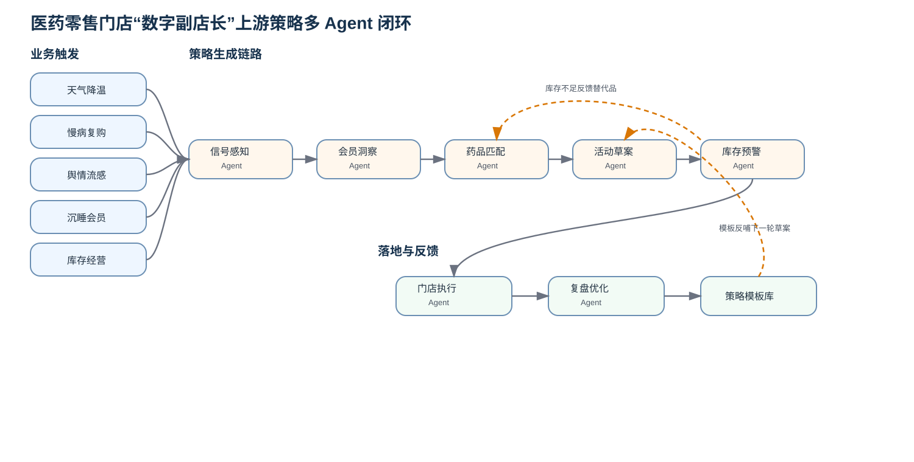

# 数字副店长上游策略多智能体完整 Demo

> 参考 `qly门店执行和复盘优化` 的项目组织方式，在原有方案文档基础上补齐可运行交互原型、Agent 规则逻辑、测试文件、运行配置、流程图和示例数据。



## 1. 项目定位

本项目聚焦医药零售门店“活动生成之前”的上游策略链路，解决从经营信号到活动方案之间的断点。系统通过多 Agent 协同，把机会信号、会员洞察、药品推荐、活动草案和库存承接串成一条可展示、可讲解、可运行的闭环。

核心链路：

```text
机会信号 → 会员洞察 → 药品匹配 → 活动草案 → 库存预警 → 门店执行 → 活动复盘 → 策略模板
```

## 2. 已补齐内容

相比上一个文档包，本次补齐了完整 Demo 项目所需文件：

- `index.html`：可直接打开的交互原型页面。
- `styles.css`：页面视觉样式。
- `src/agents.js`：药品匹配、活动草案、库存预警三个 Agent 的规则逻辑。
- `src/app.js`：页面交互逻辑，负责读取表单、调用 Agent、渲染结果。
- `tests/agents.test.js`：Agent 规则测试。
- `package.json`：项目运行与测试脚本。
- `.gitignore`：GitHub 提交忽略配置。
- `diagrams/agent_workflow.svg`：GitHub README 可直接展示的流程图。

## 3. 核心 Agent

| Agent | 一句话定位 | 输出结果 |
| --- | --- | --- |
| 药品匹配 Agent | 把“会员需求与经营信号”翻译成“合规可推荐的品类清单” | 推荐品类、推荐理由、合规提示、决策依据 |
| 活动草案 Agent | 把“推荐品类与目标人群”翻译成“可审核发布的活动方案” | 活动名称、券包、渠道、触达计划、门店动作、审核清单 |
| 库存预警 Agent | 把“活动需求”翻译成“门店能不能接、怎么补货、是否需要替代品” | 风险等级、补货建议、替代方案、发布决策 |

## 4. Demo 运行方式

### 方式一：直接打开

双击打开：

```text
index.html
```

然后在页面中调整场景、会员、库存、门店数等输入，点击：

```text
一键运行策略链路
```

即可看到三个 Agent 的联动输出。

### 方式二：本地服务运行

```bash
npm install
npm run start
```

浏览器打开终端提示的本地地址。

### 方式三：运行测试

```bash
npm test
```

测试会验证：

- 药品匹配 Agent 能生成推荐品类和合规提示；
- 活动草案 Agent 能生成券包、门店动作和审核清单；
- 库存预警 Agent 能在低库存时给出补货建议和发布限制；
- 库存充足时能给出可发布决策。

## 5. 项目结构

```text
.
├─ README.md
├─ package.json
├─ .gitignore
├─ index.html
├─ styles.css
├─ src/
│  ├─ agents.js
│  └─ app.js
├─ tests/
│  └─ agents.test.js
├─ docs/
│  ├─ agent_design.md
│  ├─ drug_match_agent.md
│  ├─ campaign_draft_agent.md
│  ├─ stock_warning_agent.md
│  ├─ workflow.md
│  └─ mvp_plan.md
├─ diagrams/
│  ├─ agent_workflow.mmd
│  └─ agent_workflow.svg
└─ examples/
   ├─ drug_match_example.json
   ├─ campaign_draft_example.json
   ├─ stock_warning_example.json
   └─ full_strategy_example.json
```

## 6. 答辩口径

本项目不是简单做一个活动配置页，而是把医药零售门店主动经营拆成多 Agent 协作流程。系统先识别机会，再判断哪些会员值得触达、哪些品类适合推荐、活动券包怎样设计、门店库存能否承接，最后把结果交给门店执行和复盘优化模块。这样可以把“人工拍脑袋做活动”升级为“数据驱动、合规审核、门店可执行、结果可复用”的数字副店长闭环。
