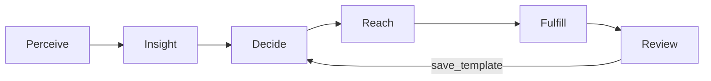

# PRD：数字副店长工作台（MVP v1.0）

**可直接用于前后端开发拆解的版本**  
**适用**：连锁医药零售（总部运营 + 门店履约），会员增长与智能运营场景。

---

## 0. 文档控制

| 项目 | 内容 |
|------|------|
| 产品名称 | 数字副店长工作台 |
| 版本 | MVP v1.0 |
| 形态 | Web 后台（总部）+ 门店执行视图（店长/店员）+ AI 策略助手 |
| 核心闭环 | 感知 → 洞察 → 决策 → 触达 → 履约 → 复盘 |
| 智能体定位 | 「数字副店长」：感知、判断、执行辅助、学习沉淀（非闲聊工具） |
| 本文档读者 | 产品 / 前端 / 后端 / 测试 / 售前 / 项目经理 |
| 前端 Demo | 见 [DEMO.md](./DEMO.md)（根目录 `index.html` 打开即可） |

---

## 1. 战略对齐与客户预期（立项语境）

### 1.1 领导真正关心的结果（非“做一个系统”）

- **存量会员挖增量**：会员资产从“可查”变为“可运营、可转化”。
- **经营模式转变**：从“人找药”转为“药找人”，主动触达与到店承接。
- **关键抓手**：慢病复购周期管理、季节性疾病与天气变化的前置拦截；对门店坪效与会员 LTV 有直接贡献。
- **数字化标杆叙事**：客户高层重视 **全链路自动化** —— 强调 **闭环、自运营、可复制**，而非每次活动从零人工配置。
- **触发类场景**：舆情、天气、季节等外部信号进入 **感知 → 决策 → 执行 → 反馈** 的闭环（医药合规边界见第 10 章）。

### 1.2 内部售前判断框架（可选附录用语）

| 对齐深度 | 典型立项特征 | 备注 |
|----------|----------------|------|
| 浅 | 主要响应 IT 建设诉求 | 立项金额区间通常偏低 |
| 深 | 对齐具体业务高层的关键行动项（存量会员增长、坪效、慢病管理、自动化运营标杆） | 更易形成规模化预算 |

> 开发团队实现时以业务闭环与可验收指标为准；金额区间不作为功能需求。

---

## 2. 术语表

| 术语 | 定义 |
|------|------|
| 机会信号 | 来自天气/季节/舆情/地理等的外部或衍生信号，可触发运营动作 |
| 人群包 | 满足一组筛选规则的会员集合，可版本化、可审计 |
| 活动草案 | 系统生成的待审核营销方案（券、渠道、时间、门店动作） |
| 策略模板 | 经复盘沉淀的可复用策略配置（触发条件 + 人群口径 + 券建议 + 渠道建议） |
| 履约 | 会员到店核销、店员话术承接、店长补货确认等门店侧动作 |
| 数字副店长 | 产品人格化名称；后台可由多 Agent 协同实现 |

---

## 3. 角色、规模与权限（MVP）

### 3.1 角色定义

| 角色 | 职责摘要 | MVP 权限策略 |
|------|-----------|----------------|
| 总部运营 | 审核策略、调规则阈值、管理券模板、复盘沉淀 | 可读全试点区域数据；可发布活动；可编辑人群规则草案 |
| 门店店长 | 任务分配、补货确认、异常调整 | 读本店任务、会员清单、库存建议；确认/调整数量 |
| 门店店员 | 到店承接、核销协助、反馈记录 | 读会员服务卡；标记履约反馈 |
| 会员用户 | 被触达与服务对象 | 不在本后台登录；触达渠道侧承载 |

### 3.2 用户规模（试点假设）

| 角色 | 规模（示例） |
|------|----------------|
| 总部运营 | 3–5 人 |
| 门店侧 | 每店 1–2 人；50 店试点约 **50–100 人** |

### 3.3 MVP 权限实现建议

- MVP 可采用 **视图切换**（同账号演示三地角色）或 **简单角色字段**（`role=hq|manager|staff`）。
- 不做完整 RBAC 矩阵；日志记录关键动作：**审核、发布、调整人群、调整券、确认补货、履约反馈**。

---

## 4. 业务流程（强制闭环）

### 4.1 六阶段定义

| 阶段 | 业务含义 | 关键产出 | 人工闸门（默认开启） |
|------|-----------|-----------|------------------------|
| 感知 | 捕获外部/内部信号 | 机会卡片、优先级 | 是否生成机会 / 是否忽略 |
| 洞察 | 画像 + 用药周期 + 标签匹配 | 人群包 + 推荐原因 | 是否调整人群规则 |
| 决策 | 生成活动草案 | 券包、渠道、触达时间、门店动作包 | **发布前审核** |
| 触达 | 推送消息与券 | 触达批次、到达回执（可模拟） | 频次与时段策略 |
| 履约 | 到店承接与补货 | 任务清单、话术卡、补货确认 | 店长确认补货量 |
| 复盘 | 指标与结论 | 漏斗、结论、模板沉淀 | 是否入库为策略模板 |

### 4.2 端到端流程图（逻辑）



---

## 5. 痛点与需求溯源（验收讲故事用）

### 5.1 总部运营

| 痛点 | 描述 | 频率 | 关联指标 |
|------|------|------|-----------|
| 活动赶不上变化 | 换季/舆情热点时人工排期过长，错过窗口 | 周频；换季/热点加密 | 时机覆盖率、响应时长 |
| 标签割裂 | 会员标签与药品标签分散，Excel 人工匹配错配 | 高频 | 人群准确率、投诉率 |

### 5.2 门店店长 / 店员

| 痛点 | 描述 | 频率 | 关联指标 |
|------|------|------|-----------|
| 有会员没抓手 | 不清楚谁临近复购、今日重点服务谁 | 日频 | 主动接待率、核销率 |
| 被动等客 | 缺工具/话术/权限完成主动经营 | 日频 | 到店转化、关联销售 |
| 补货拍脑袋 | 畅销缺货与滞销积压并存；大客流门店更难 | 日频 | 缺货率、损耗、损耗周转 |

---

## 6. 人机协作模型（产品核心）

### 6.1 与总部运营协作

- **过去**：人工策划、人工筛人群、人工配券、重复配置。
- **现在**：系统实时盯信号 → 自动匹配标签 → **生成活动草案**；运营负责：
  - 审核逻辑与边界（合规）
  - 调整阈值/规则
  - 异常复盘与模板沉淀

### 6.2 与门店协作

- **店长**：每日打开 **门店执行中心**，查看智能体计算的今日重点名单、任务优先级、补货建议；支持一键确认或微调。
- **店员**：接待时查看 **会员服务卡**（画像摘要、用药周期、可用券、推荐话术、风险提示）；支持履约反馈（已购/不感兴趣等）。
- **渠道假设**：企微侧边栏为最佳实践之一；**MVP 可用 Web 侧栏模拟**，接口预留。

---

## 7. 多 Agent 架构（实现映射，非一级导航）

### 7.1 原则

- **前台**：按业务场景导航（会员洞察、策略运营、门店执行、复盘等）。
- **后台**：多 Agent 分工协同；页面展示为 **来源 Agent / 协同 Agent / 判断依据**，避免让用户学习 Agent 清单。

### 7.2 Agent 分工表（后端/编排参考）

| Agent | 职责 | 典型输出 | 人工审核点 |
|-------|------|-----------|------------|
| 主控 | 调度与汇总 | 综合建议、跳转指令 | 是否采纳 |
| 信号感知 | 天气/季节/舆情/热点 | 机会信号与优先级 | 是否立项 |
| 会员洞察 | 画像、周期、沉睡识别 | 人群包、解释 | 人群调整 |
| 药品匹配 | 品类关联与边界提示 | 推荐品类清单 | 品类确认 |
| 活动策略 | 草案：券/渠道/时间 | 活动草案 | **发布** |
| 库存履约 | 库存承接、补货 | 风险SKU、建议量 | 补货确认 |
| 门店执行 | 任务拆解、话术 | 店长任务、店员卡 | 分配与执行 |
| 复盘优化 | 结论与模板 | 复盘报告、优化建议 | 模板入库 |

---

## 8. 信息架构（IA）与路由

### 8.1 一级导航（建议）

```
工作台首页
会员洞察
策略运营
门店执行
活动复盘
策略模板
```

### 8.2 路由清单（前端开发）

| routeKey | 路径（示例） | 页面名称 | 默认角色 |
|----------|----------------|-----------|-----------|
| dashboard | `/` 或 `/dashboard` | 工作台首页 | 总部 |
| insights | `/insights` | 会员洞察 | 总部 |
| campaigns | `/campaigns` | 策略运营 | 总部 |
| stores | `/stores` | 门店执行 | 店长/店员 |
| review | `/review` | 活动复盘 | 总部 |
| templates | `/templates` | 策略模板 | 总部 |

门店执行建议子路由：

| 子路由 | 说明 |
|--------|------|
| `/stores/manager` | 店长视图 |
| `/stores/staff` | 店员视图（会员服务卡） |

### 8.3 UI 设计规范（工作台意向）

视觉令牌、全局壳层布局、工作台 Hero / 常用应用 / 全部分类 Tab、「添加常用」Modal、组件状态与响应式等，见 **[DESIGN-SPEC-B-WORKBENCH.md](./DESIGN-SPEC-B-WORKBENCH.md)**。实现时建议：**壳层侧栏 + 顶栏** 承载全局导航；PRD 一级模块优先通过工作台 **卡片网格** 与 **分类 Tab** 进入（Agent 名称不作为一级导航外露）。

---

## 9. 领域模型与核心实体（后端/状态管理）

### 9.1 实体列表

| 实体 | 说明 | MVP 必备字段（最小集） |
|------|------|-------------------------|
| Opportunity | 机会信号 | id, title, reason, priority, sourceAgents[], regionId, createdAt, status(active\|ignored\|converted) |
| Segment | 人群包 | id, name, ruleDSL（或结构化规则 JSON）, memberCount, explanation, version, updatedAt |
| Member | 会员摘要 | id, nameMask, tags[], chronicProfile?, lastPurchaseAt, repurchaseWindow?, storeId |
| Campaign | 活动 | id, name, triggerSource, segmentId, status（见状态机）, channels[], couponPkg, scheduleAt, createdBy, auditLog[] |
| ReachBatch | 触达批次 | id, campaignId, channel, scheduledAt, status(mocked), stats(delivered可选) |
| StoreTask | 门店任务 | id, campaignId, storeId, type, dueAt, assignee?, status |
| RestockSuggestion | 补货建议 | id, storeId, skuId, skuName, suggestedQty, reason, confirmedQty?, status |
| StaffCard | 店员服务卡 | memberId, campaignId?, scripts, coupons, riskNote |
| ReviewReport | 复盘 | campaignId, funnel, conclusions[], improvements[], exportUrl? |
| StrategyTemplate | 策略模板 | id, name, triggerPattern, segmentRule ref, couponTemplate, channelPrefs, evidenceCampaignIds[] |

### 9.2 活动状态机（强制）

```
draft → pending_review → pending_launch → running → completed → (archived)
                              ↑____________↓（驳回回到 draft）
completed → promoted_to_template（生成 StrategyTemplate，可选自动）
```

**规则**：

- `pending_review → pending_launch`：**总部审核通过**。
- `pending_launch → running`：到达计划开始时间或手动开始（MVP 可二选一，需全局一致）。
- `running → completed`：到达结束时间或手动结束。
- 驳回：`pending_review → draft` 记录原因与时间。

---

## 10. 合规与安全（硬约束）

### 10.1 医药合规

- 系统输出定位为 **健康关怀与零售推荐**，**不做诊疗结论**，**不替代医生**。
- **处方药**：默认不推荐自动化强干预；若展示须在审核闸门强制勾选与留痕（MVP 可配置为“禁止自动推荐处方药”）。
- 店员界面固定展示 **风险提示文案**（不可关闭，见 12.4）。

### 10.2 会员体验与打扰控制

- 全局：同类活动冷却天数、日触达上限、禁扰时段。
- 会员侧退订/拒收机制（MVP 可仅字段预留 + mock）。

---

## 11. 功能需求详述（按模块）

以下每条包含：**页面目标 / 关键 UI / 字段 / 操作 / 验收标准（AC）**。

---

### 11.1 工作台首页（Dashboard）

**目标**：回答——今天有什么机会？要审什么？多少会员可被转化？下一步去哪？

**模块布局**

1. **副店长状态条**：在线/离线（mock）、昨夜批任务时间、异常数。
2. **指标卡**：今日新增机会数、待审核活动数、高风险缺货 SKU 数、预计可转化会员数（可由 segment 汇总）、待确认事项数。
3. **机会卡片列表**（来自 Opportunity）  
   - 字段：标题、触发摘要、优先级、影响会员规模（估算）、建议动作。
   - 操作：`生成活动` | `查看影响会员` | `查看库存风险` | `忽略` | `问 AI 助手`
4. **AI 策略助手**（右侧 Dock 或抽屉）  
   - 快捷问题（可配置 JSON）：本周慢病复购、区域降温影响、推荐原因解释、库存风险门店、保存模板等。
   - 回复结构固定：**触发原因 / 目标 / 活动建议 / 渠道与时间 / 预估 / 下一步按钮**。

**验收标准（AC）**

- AC-D1：机会卡片至少展示 4 类示例（天气、慢病复购、沉睡、舆情）。
- AC-D2：点击「生成活动」跳转策略运营并携带 `opportunityId`（或 segment 草稿）。
- AC-D3：点击「查看影响会员」跳转会员洞察并打开对应人群包。
- AC-D4：忽略操作将 Opportunity 标记为 `ignored` 且从默认列表消失（可筛选找回）。
- AC-D5：助手回复使用统一模板组件渲染（非纯文本堆砌）。

---

### 11.2 会员洞察（Insights）

**目标**：解释 **为什么推荐这批会员**，支持调整规则并一键带去策略运营。

**布局**：三栏 —— 分层概览 | 人群包列表 | 右侧解释 + 会员列表。

**分层类型（示例枚举）**

- 慢病会员 / 即将复购 / 天气敏感 / 沉睡 / 高价值（可配置）

**人群包详情抽屉**

- 筛选规则（结构化展示：时间窗、品类标签、区域、冷却期、库存承接过滤）
- `memberCount`
- `explanation`（自然语言 + 特征要点）
- 操作：`用于生成活动` | `调整规则` | `导出清单（CSV，可选 MVP 延后）`

**会员列表列（最小）**

- 脱敏姓名、年龄档、标签、最近购药摘要、复购倒计时、推荐动作

**验收标准（AC）**

- AC-I1：选中人群包后右侧必须展示 **不少于 3 条可解释要点**。
- AC-I2：`用于生成活动` 跳转策略运营并预填 `segmentId`。
- AC-I3：规则调整后 `memberCount` 与 `version` 变化可追溯（显示更新时间）。

---

### 11.3 策略运营（Campaigns）

**目标**：活动全生命周期管理；强审核；可看 AI 判断依据。

**列表视图**：按状态 Tab —— `draft | pending_review | pending_launch | running | completed`，附加 **策略模板**入口。

**活动详情页字段（最小）**

| 字段 | 类型 | 说明 |
|------|------|------|
| name | string | 活动名称 |
| triggerSource | enum | weather/sentiment/chronic/stock/manual |
| segmentId | fk | 绑定人群包 |
| recommendedSkus | string[] | 推荐品类（展示层） |
| couponPkg | object | 满减规则数组 |
| channels | enum[] | wecom/sms/miniprogram |
| scheduleAt | datetime | 触达时间 |
| storePlaybook | text | 门店动作说明 |
| aiEvidence | object | 结构化证据（信号、历史核销率等） |

**操作**

- `提交审核`（draft → pending_review）
- `审核通过` / `驳回`
- `确认执行/发布`（pending_review → pending_launch → running 的具体过渡按第 9.2）
- `调整人群`（跳转 insights）
- `调整券包`（侧抽屉表单）
- `查看 AI 判断依据`（侧抽屉）
- `保存为策略模板`（completed 或 running 结束按钮）

**验收标准（AC）**

- AC-C1：任一活动详情可展示完整字段集合。
- AC-C2：未审核通过不可进入 `running`。
- AC-C3：审核动作写入 `auditLog`（人、时间、动作、备注）。
- AC-C4：`调整券包` 必须校验最低毛利率规则（可先 mock 校验开关）。

---

### 11.4 门店执行（Stores）

#### 11.4.1 店长视图

**模块**

- 今日任务概览（计数、逾期）
- 重点任务列表（Campaign 拆解）
- 重点会员列表（本店过滤）
- 补货建议表

**补货表字段**：SKU、建议量、原因、当前库存天数（mock）、操作（确认/调整）

**验收标准（AC）**

- AC-SM1：任务按 `dueAt` 排序，逾期标红。
- AC-SM2：确认补货写入 `confirmedQty` 与确认人时间。
- AC-SM3：可从任务钻取到「活动摘要」只读页。

#### 11.4.2 店员视图（会员服务卡）

**模块**

- 会员基础信息与标签
- 历史购药时间轴（摘要）
- AI 推荐要点（可折叠）
- 可用优惠券列表
- 推荐话术（可复制）
- **风险提示**（固定条款）
- 履约反馈：`标记已购买` | `不感兴趣` | `记录反馈文本`

**风险提示（默认文案，开发请固化为组件）**

> 本系统仅提供健康关怀与购药提醒，不替代医生诊疗与用药指导。请遵循药师建议与处方要求。

**验收标准（AC）**

- AC-SS1：服务卡加载时间目标 \< 300ms（mock 数据环境下）。
- AC-SS2：任一反馈写入履约流水，可供复盘聚合。
- AC-SS3：话术一键复制可用。

---

### 11.5 活动复盘（Review）

**目标**：把结果结构化，并沉淀模板。

**布局**

- 顶部 KPI：触达、领券、核销、销售额（mock）、库存消化率
- 左侧：漏斗图（触达→领券→核销→关联销售）
- 中部：高转化人群特征 / 高转化门店列表
- 右侧：AI 复盘结论文本 + 优化建议列表
- 底部：`保存为策略模板` | `导出报告（可选）` | `开启下一轮（可选）`

**验收标准（AC）**

- AC-R1：选择已完成活动 `completed` 才可进入复盘详情。
- AC-R2：结论区至少 4 条洞察（示例数据可预制）。
- AC-R3：保存模板生成 `StrategyTemplate` 并在策略模板库可见。

---

### 11.6 策略模板（Templates）

**目标**：可复用策略资产库。

**列表字段**：名称、触发模式摘要、最近验证转化率（mock）、状态（draft/verified）

**详情**：展开触发条件、人群口径引用、券模板、渠道偏好、适用区域。

**操作**：从模板 **一键创建活动草案**（生成 `Campaign` in `draft`）。

**验收标准（AC）**

- AC-T1：模板创建活动继承字段并可编辑。
- AC-T2：模板变更不影响历史活动实例（版本隔离）。

---

## 12. 跨模块跳转矩阵（前端事件）

| 来源 | 动作 | 目标 | 参数 |
|------|------|------|------|
| 工作台 | 生成活动 | 策略运营 | opportunityId |
| 工作台 | 查看影响会员 | 会员洞察 | segmentId |
| 工作台 | 查看库存风险 | 门店执行 | storeId（默认当前店或总部选择） |
| 会员洞察 | 用于生成活动 | 策略运营 | segmentId |
| 策略运营 | 调整人群 | 会员洞察 | segmentId |
| 策略运营 | 确认发布 | 门店执行 | campaignId |
| 门店执行 | 标记已购买 | 复盘预聚合 | memberId + campaignId |
| 活动复盘 | 保存模板 | 策略模板 | campaignId |

---

## 13. 模拟数据与接口（MVP）

### 13.1 MVP 数据策略

- 全部实体可使用 **本地 JSON / Mock API**；字段必须符合第 9 章以便将来替换为真实服务。
- “触达发送”“ERP 补货下发” **全部模拟**，展示状态即可。

### 13.2 建议 API 草图（后端对接时替换）

| Method | Path | 说明 |
|--------|------|------|
| GET | `/api/opportunities` | 机会列表 |
| POST | `/api/campaigns` | 创建草案 |
| PATCH | `/api/campaigns/:id/status` | 状态迁移 |
| GET | `/api/segments/:id` | 人群包详情 |
| GET | `/api/stores/:id/tasks` | 门店任务 |
| POST | `/api/fulfillment/feedback` | 店员反馈 |

（路径仅为约定，可按团队规范调整。）

---

## 14. 非功能需求（NFR）

| 类别 | 要求 |
|------|------|
| 性能 | 总部列表页 1s 内首屏（不含大图）；交互反馈 \< 200ms |
| 可用性 | 关键表单支持键盘导航；错误提示可读 |
| 可观测 | 埋点：审核、发布、忽略机会、补货确认、反馈提交 |
| 审计 | 审核与发布不可删除日志（软删除） |
| 国际化 | MVP 仅中文 |
| 无障碍 | 对比度满足基础可读（渐进） |

---

## 15. MVP 范围与不做的内容

### 15.1 必做（本轮）

- IA 六模块可用闭环演示（含模拟数据）
- 活动状态机 + 审核日志
- 门店店长/店员双视图
- 复盘页 + 模板沉淀

### 15.2 明确不做（可列 backlog）

- 真实 CRM/ERP/CDP 对接
- 真实短信/企微发送与回执全链路
- 复杂算法模型训练平台
- 完整 RBAC 与组织层级权限

---

## 16. 测试要点（QA）

- 状态机非法迁移拒绝（例：`draft` 直接 `running`）。
- 审核驳回路径可追溯。
- 冷却期规则生效（同类活动重复拦截）。
- 店员风险提示组件不可被样式隐藏（快照测试可选）。

---

## 17. 里程碑建议

| 阶段 | 产出 |
|------|------|
| M1 | IA + 路由 + Mock 数据模型 + Dashboard |
| M2 | Insights + Campaigns（含审核） |
| M3 | Stores 双视图 + 履约反馈 |
| M4 | Review + Templates + 端到端演示脚本 |

---

## 18. 与当前 HTML Demo 的对齐说明

[`index.html`](../index.html) 已按第 8 章 **场景导航** 落地：**工作台、会员洞察、策略运营、门店执行（店长/店员）、活动复盘、策略模板**；工作台首页含 Hero、常用应用、「添加常用」Modal、全部分类 Tab、机会列表与 AI 助手骨架。**Agent** 仅在机会卡片与洞察解释中以「来源 / 协同」标注。

仍为 **静态示意**、未接后端的部分：

- 策略运营状态 Tab、审核流转与真实状态机未联动。
- 搜索 Cmd+K、通知、埋点为占位。
- 复制话术等可为后续 `navigator.clipboard` 增强。

详细映射见 [DEMO.md](./DEMO.md)。

---

## 19. 附录 A：客户关键问答摘要（答辩可用）

| 询问目的 | 预期要点 |
|----------|-----------|
| 对齐领导什么预期 | 存量增量、盘活会员、药找人、慢病与季节拦截、自动化闭环标杆 |
| 业务设计与角色 | 六环节闭环；总部运营 + 门店履约；试点人数规模 |
| 痛点与频率 | 总部响应慢、标签割裂；门店无抓手、补货盲目；日频/周频 |
| 智能体角色 | 数字副店长；总部养策略；门店外挂大脑；店员服务卡 |

---

## 20. 附录 B：演示脚本（验收）

1. Dashboard 发现「降温关怀」机会 → 查看人群解释。
2. 一键生成活动草案 → 提交审核 → 审核通过 → 进入待开展。
3. 切换店长视图：看到任务与补货 → 确认补货。
4. 切换店员视图：打开会员服务卡 → 一键复制话术 → 提交反馈。
5. 活动结束 → 复盘页查看漏斗 → 保存策略模板。
6. 策略模板库 → 从模板再生成新草案。

---

**文档结束**
