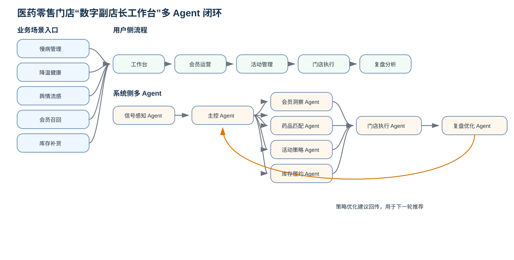

# 医药零售门店数字副店长多智能体方案

> 课程小组作业：围绕医药零售门店主动经营，设计一套从信号识别到执行复盘的多智能体协同方案。



## 项目背景

医药零售门店正在同时面对三个现实问题：线下客流下降、会员资产沉睡、运营响应滞后。很多门店并不是缺少数据，而是会员数据、药品数据、库存数据、天气信号、舆情热点和慢病复购周期彼此割裂，导致门店仍然主要依赖人工经验开展经营。

本项目希望通过多智能体协同，把“感知—洞察—决策—触达—履约—复盘”串成一个闭环，让门店从被动等客，逐步转向主动经营。

## 战略目标

1. 让门店能够更早识别经营机会，而不是只在销量变化后被动反应。
2. 让总部策略能够更顺畅地下沉到门店一线，减少执行断层。
3. 让会员运营、药品推荐、库存履约和活动复盘形成数据闭环。
4. 让成功经验可以被复用，帮助下一轮活动做得更准、更快。

## 核心业务场景

- 慢病会员复购提醒
- 降温天气健康提醒
- 流感舆情热点联动
- 沉睡会员召回
- 库存补货与近效期商品消化

## 多 Agent 总体架构

项目采用“主控 Agent + 专项 Agent”协同模式：

- **信号感知 Agent**：识别天气、舆情、复购周期等经营信号。
- **主控 Agent**：判断是否发起活动，并统筹各 Agent 协作。
- **会员洞察 Agent**：筛选目标会员、识别标签和需求。
- **药品匹配 Agent**：推荐合适品类并提供合规提醒。
- **活动策略 Agent**：生成活动方案、券包规则和触达建议。
- **库存履约 Agent**：检查库存、缺货风险和补货建议。
- **门店执行 Agent**：把总部方案拆成门店可执行任务。
- **复盘优化 Agent**：分析活动结果，沉淀下一轮优化策略。

## 方案亮点

- 不只生成活动建议，而是继续推动到门店执行；
- 不只看销售结果，而是解释活动为什么有效或无效；
- 通过执行数据和复盘结果反哺下一轮策略，形成持续优化闭环。

## Demo 运行方式

本项目附带一个可离线运行的网页 Demo，用于演示两个 Agent 如何协同工作：

1. 直接打开 `index.html`；
2. 在“场景输入”中调整活动信息；
3. 点击“运行门店执行 Agent”；
4. 补充执行结果数据；
5. 点击“运行复盘优化 Agent”；
6. 查看任务生成、问题归因、优化建议和模板沉淀结果。

如果希望通过本地服务访问，也可以执行：

```bash
npm run start
```

然后在浏览器中打开终端提示的本地地址。

## 项目结构

项目按“展示层、逻辑层、文档层、示例层”组织：

- **展示层**：`index.html`、`styles.css`
- **逻辑层**：`src/`
- **测试层**：`tests/`
- **文档层**：`docs/`
- **图示层**：`diagrams/`
- **示例层**：`examples/`

## 我负责的两个 Agent

### 门店执行 Agent

门店执行 Agent 负责把“总部活动方案”翻译成“门店今日任务”，让店长知道今天重点做什么，让店员知道面对会员时如何承接，并把执行结果及时回传。

### 复盘优化 Agent

复盘优化 Agent 负责把“活动结果”转化为“下一轮策略优化建议”，不仅看销售结果，也解释为什么有效或无效，并把成功经验沉淀成可复用模板。

## 文件目录说明

```text
.
├─ README.md
├─ package.json
├─ .gitignore
├─ index.html
├─ styles.css
├─ src/
│  ├─ agents.js
│  └─ app.js
├─ tests/
│  └─ agents.test.js
├─ docs/
│  ├─ agent_design.md
│  ├─ store_execution_agent.md
│  ├─ review_optimization_agent.md
│  └─ workflow.md
├─ diagrams/
│  └─ agent_workflow.mmd
└─ examples/
   ├─ store_execution_example.json
   └─ review_optimization_example.json
```

其中：

- `README.md`：项目总览，适合老师或组员快速阅读。
- `index.html`：可直接打开的 Demo 页面。
- `src/agents.js`：两个 Agent 的规则逻辑。
- `src/app.js`：页面交互逻辑。
- `tests/agents.test.js`：Agent 规则测试。
- `docs/agent_design.md`：总体 Agent 架构说明。
- `docs/store_execution_agent.md`：门店执行 Agent 详细设计。
- `docs/review_optimization_agent.md`：复盘优化 Agent 详细设计。
- `docs/workflow.md`：端到端业务闭环流程说明。
- `diagrams/agent_workflow.mmd`：Mermaid 流程图源码。
- `examples/`：两个 Agent 的示例输入输出数据。
